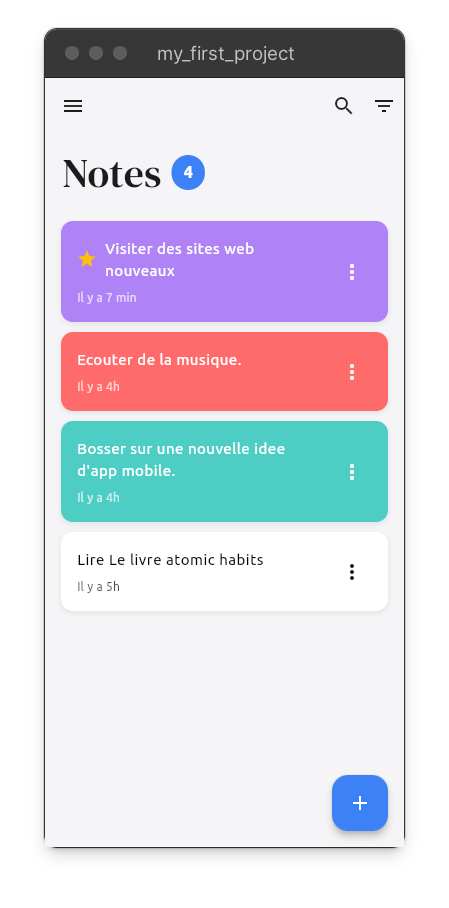
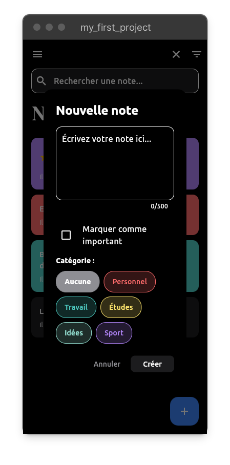
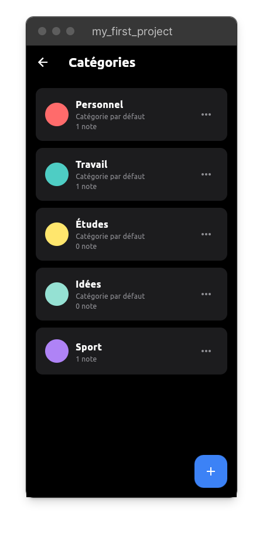
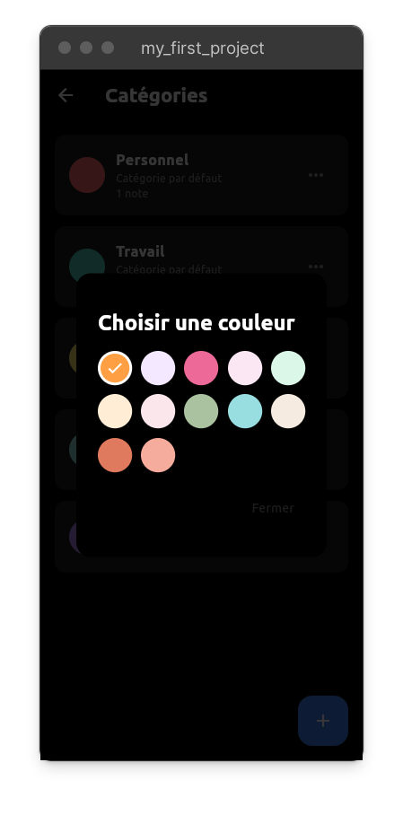
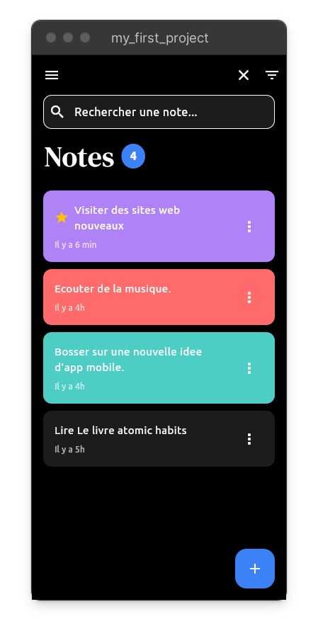

# R_noteApp

Une application Flutter moderne de prise de notes avec gestion des catégories et thèmes sombre/clair.

## Description

R_noteApp est une application de prise de notes intuitive et puissante qui vous permet d'organiser vos pensées, idées et tâches quotidiennes. Avec un système de catégories personnalisables, des notes importantes, et une recherche avancée, gardez le contrôle de vos informations importantes.

## Fonctionnalités

- ✅ **Création et gestion de notes** : Créez, modifiez et supprimez des notes facilement
- ✅ **Système de catégories** : Organisez vos notes par catégories personnalisables
- ✅ **Notes importantes** : Marquez vos notes comme importantes pour les retrouver rapidement
- ✅ **Recherche avancée** : Trouvez vos notes instantanément avec la fonction de recherche
- ✅ **Filtres intelligents** : Filtrez par catégorie ou par importance
- ✅ **Thèmes sombre/clair** : Adaptez l'interface à vos préférences
- ✅ **Interface moderne** : Design épuré et intuitif
- ✅ **Stockage local** : Vos données restent sur votre appareil

## Captures d'écran

### Interface principale

*Écran d'accueil montrant la liste des notes avec compteur*

### Création d'une note

*Dialogue de création de note avec sélection de catégorie et option important*

### Gestion des catégories

*Page de gestion des catégories personnalisables*

### Paramètres et thème

*Selection des couleurs

### Recherche et filtres

*Fonctionnalités de recherche et filtrage des notes*

## Installation

### Prérequis

- Flutter SDK (version 3.5.2 ou supérieure)
- Dart SDK
- Android Studio ou VS Code avec extensions Flutter

### Étapes d'installation

1. **Clonez le repository**
   ```bash
   git clone https://github.com/Rahim10020/NoteApp-Mkoko-
   cd R_noteApp
   ```

2. **Installez les dépendances**
   ```bash
   flutter pub get
   ```

3. **Générez les fichiers Isar**
   ```bash
   flutter pub run build_runner build
   ```

4. **Lancez l'application**
   ```bash
   flutter run
   ```

## Utilisation

### Créer une note
- Appuyez sur le bouton "+" en bas à droite
- Écrivez votre note
- Sélectionnez une catégorie (optionnel)
- Marquez comme important si nécessaire
- Appuyez sur "Créer"

### Organiser par catégories
- Ouvrez le tiroir latéral (menu hamburger)
- Allez dans "Catégories"
- Créez ou modifiez vos catégories

### Rechercher et filtrer
- Utilisez l'icône de recherche dans la barre d'application
- Utilisez l'icône de filtre pour filtrer par catégorie ou importance

### Changer de thème
- Ouvrez le tiroir latéral
- Allez dans "Paramètres"
- Basculez entre thème clair et sombre

## Technologies utilisées

- **Flutter** : Framework UI cross-platform
- **Dart** : Langage de programmation
- **Isar** : Base de données NoSQL locale
- **Provider** : Gestion d'état
- **Google Fonts** : Typographie
- **Path Provider** : Gestion des chemins de fichiers

## Structure du projet

```
lib/
├── components/          # Composants réutilisables
├── models/             # Modèles de données et bases de données
├── pages/              # Pages de l'application
├── theme/              # Gestion des thèmes
└── main.dart           # Point d'entrée
```

## Contribution

Les contributions sont les bienvenues ! Pour contribuer :

1. Fork le projet
2. Créez une branche pour votre fonctionnalité (`git checkout -b feature/AmazingFeature`)
3. Committez vos changements (`git commit -m 'Add some AmazingFeature'`)
4. Pushez vers la branche (`git push origin feature/AmazingFeature`)
5. Ouvrez une Pull Request

## Licence

Ce projet est sous licence MIT - voir le fichier [LICENSE](LICENSE) pour plus de détails.

## Auteur

Développé avec ❤️ par [Votre nom]

## Ressources Flutter

- [Documentation Flutter](https://docs.flutter.dev/)
- [Lab: Write your first Flutter app](https://docs.flutter.dev/get-started/codelab)
- [Cookbook: Useful Flutter samples](https://docs.flutter.dev/cookbook)
